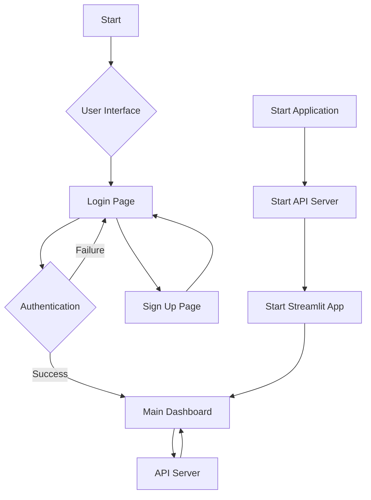
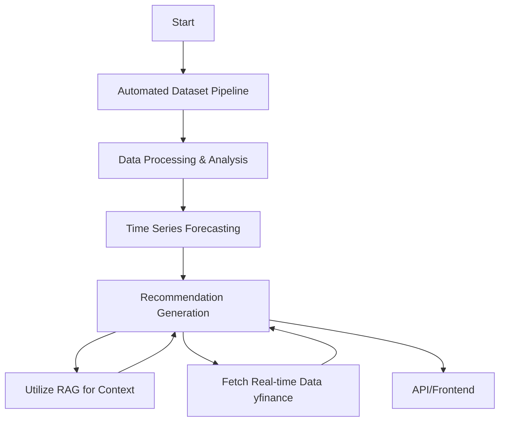
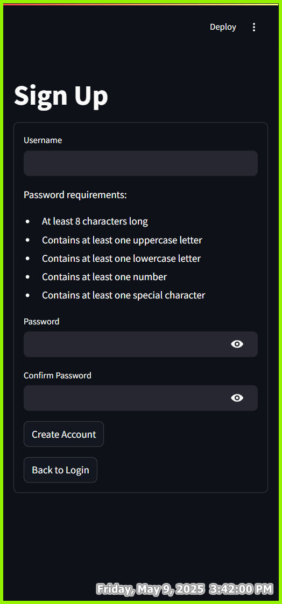

# WSP Grad Project

# Team Members:

- [x] 1. [Islam Ali]
- [x] 2. [Peter Magdy Gamil]
- [x] 3. [Mostafa Saad]
- [x] 4. [Esraa Kamel]
- [x] 5. [Mohamed Khaled]
- [ ] [no contribute] 6. [Mahmoud Mohamed Elebiare]
- [ ] [no contribute] 7. [Mohamed Alaa Eldin Fouad Ahmed Mansour]

# Demonstration video

https://github.com/user-attachments/assets/851d209c-6ade-409c-b61f-98a11ca109fa


# Streamlit flowchart



# Agents flowchart



## User Interface

### Login Page

The login page provides a secure entry point to the application. Users can enter their credentials which are verified against the hashed passwords in the database.

### Sign Up Page

New users can create an account through the sign-up page. The system validates the input and securely stores the credentials.

### Main Dashboard

After successful authentication, users are presented with the main dashboard where they can access the application's features.

# Setup the Application

```bash
pip install -r requirements.txt
```

# Running the Application

1. Start the API server first from the `project root directory`
```bash
uvicorn main:app
```
The API server will start on http://localhost:8000

2. Start the Streamlit app from the `frontend directory`
```bash
streamlit run app.py
```
The Streamlit app will be available at http://localhost:8501

Note: Make sure to start the API server before running the Streamlit app, as the frontend depends on the API being available.

3. Use this test user or sign up for a new user
```bash
username: sprints.ai
password: f7sgnqrAbZwHezx
```
# Technical Documentations

For detailed technical documentation about the authentication system, database structure, API endpoints, and security features, please refer to:
- [Database & Authentication Documentation](/docs/Authentication%20System%20Architecture.md)
